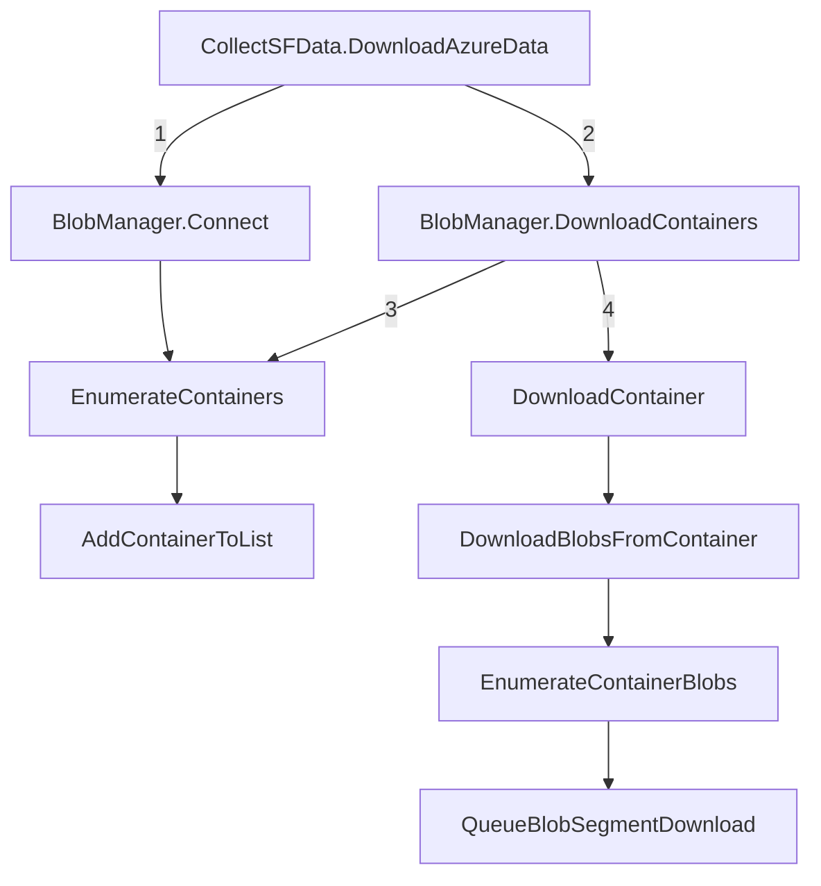

# current

```mermaid
flowchart TD;
A[CollectSFData.DownloadAzureData] 
A --> |1| B[BlobManager.Connect]
B --> C[EnumerateContainers] 
C --> D[AddContainerToList]
A --> |2| E[BlobManager.DownloadContainers]
E --> |3| C
E --> |4| F[DownloadContainer]
F --> G[DownloadBlobsFromContainer]
G --> H[EnumerateContainerBlobs]
H --> I[QueueBlobSegmentDownload]
```
